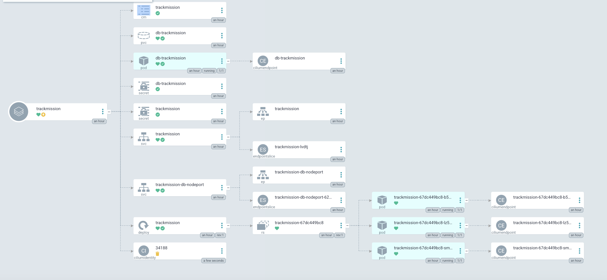

# TrackProject_2__KimJunYoung

## SNS 백엔드 서비스 개발 프로젝트

---

 

### 0. 환경 및 버전

 

언어
- Python: 3.11.3

 

라이브러리
- Django: 4.2.4
- djangorestframework: 3.14.0
- drf-spectacular: 0.26.4
- psycopg2-binary: 2.9.7
- gunicorn: 21.2.0

 

클라우드
- backend-server: ubuntu 20.04
- db-server: ubuntu 20.04

 

도커
- Docker: 24.0.5
- backend-image: python-3.11-alpine
- db-image: postgresql-13

 

IaC
- terraform: 1.5.5

k8s
- helm: 3.12.3
- argocd: 2.8.4

 

### 1. 백엔드 API 추가 개발

- 유저
    - [x] 전체 유저 목록을 불러올 때, 사용자가 해당 유저를 follow하고 있는지 여부를 알 수 있다.
    - |method|endpoint|
        |------|------|
        |GET|[/users/](http://sns-lb-staging-19617966-7a5b35a9d8d7.kr.lb.naverncp.com/users/)|

- 게시물
    - [x] 사용자는 본인의 게시물을 숨김(숨김해제)처리할 수 있다.
    - [x] 숨김처리된 게시물은 사용자 본인만 볼 수 있고, 다른 사용자는 볼 수 없다.
    - [x] 게시물에 사진을 추가할 수 있다.
    - |method|endpoint|example|
        |------|------|------|
        |POST|[/blog/post](http://sns-lb-staging-19617966-7a5b35a9d8d7.kr.lb.naverncp.com/blog/post/)|{ "title": "string", "body": "string", "is_hidden": bool,  "image":"file" }|
 

### 2. terraform 작성

- [x] 배포 및 운영에 필요한 모든 인프라를 terraform으로 관리한다.

 

### 3. multi-stage 구성

- [x] production과 staging 환경을 별도로 구성한다.
- [x] terraform 으로 손쉽게 각 환경을 구성(apply)하고, 폐기(destroy)할 수 있다.
  - Staging: [API docs](http://sns-lb-staging-19617966-7a5b35a9d8d7.kr.lb.naverncp.com/api/docs)
  - Production: 코드로 대체합니다.

 

### 4. k8s로 배포

- 서비스를 k8s로 배포한다.
  - k8s loadBalancer: [API docs](http://default-trackmission-0c522-19621759-db19447d1478.kr.lb.naverncp.com/api/docs)

  

## 도전 미션 개요

---

### monitoring 시스템 구축

- [ ] 500에러 혹은 scale up/down이 일어날 때, 알람을 보낸다.
  - 미구현

### terraform modulizing

- [x] terraform코드를 모듈화하여 재사용 가능하게 만든다.
  - terraform 모듈을 network, server, loadBalancer로 나누어 모듈화하였고 재사용 가능하도록 구성하였습니다.

### K8s CICD 구축

- [x] k8s CICD 파이프라인을 구축한다.
  - k8s deployment, service등 서비스에 필요한 것들을 helm 차트를 사용하여 구성해두고 ArgoCD를 사용하여 application을 생성하였습니다.
  - github과 자동으로 싱크하여 릴리즈 태그가 있을때 커밋후 푸시하여 배포합니다.

- argocd 

